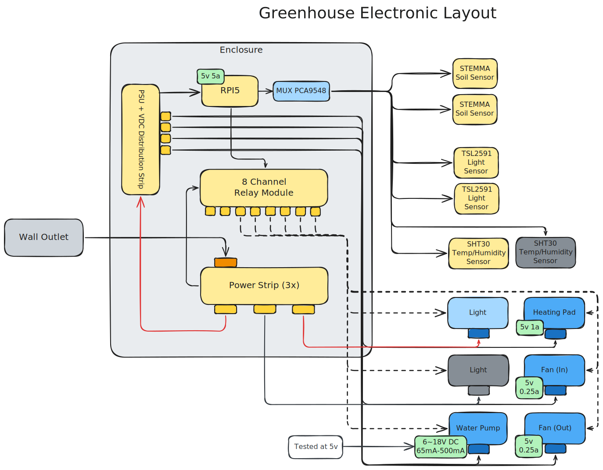
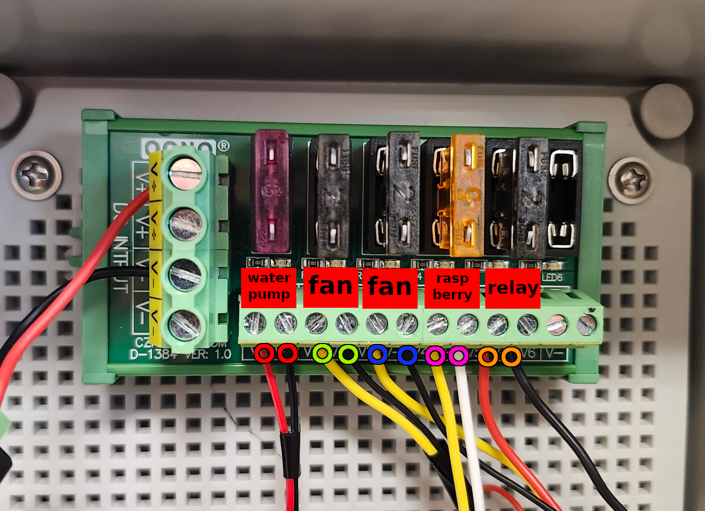
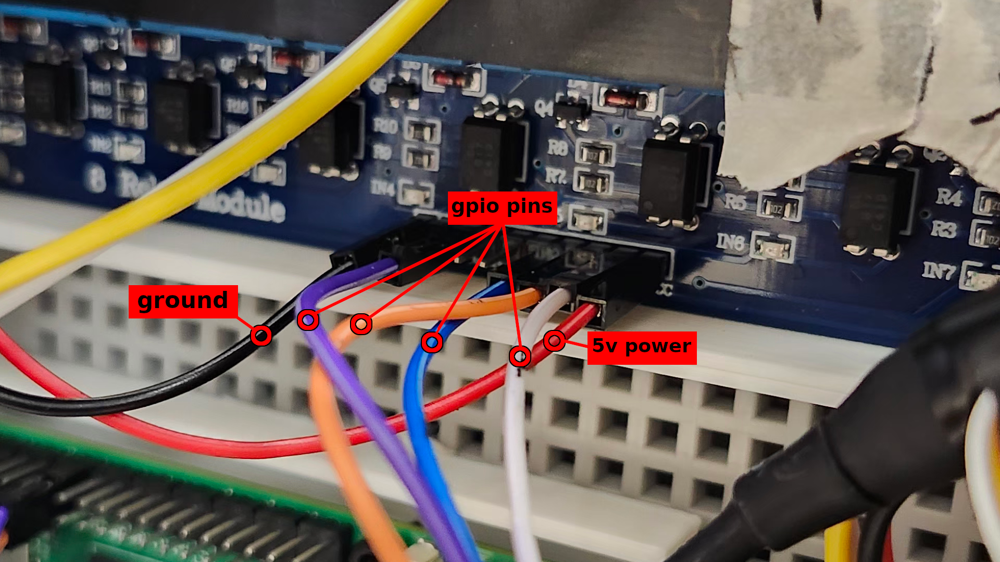
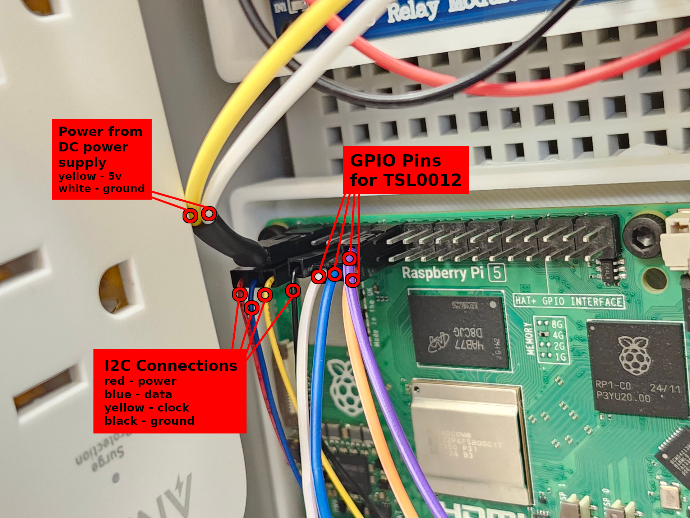

# Greenhouse Electrical Wiring
This section will go over the wiring of the current version of the electrical enclosure. It'll be broken down into the following sections:

* Wiring Power
* Wiring Instruments
* Wiring Relay
* Wiring Raspberry Pi 5
* Wiring Sensors

In addition, this section will also cover smaller but essential concepts:

* Connector types
* Extending connectors

## Layout:

**TODO: Modify diagram to remove old unused components**

## Wiring Power

For power distribution, there are three main components:
1. Compact surge protector (3 outlets)
    * NOTE: If the specific surge protector (or any compact surge protectors), an alternative is potentially an AC distribution block with custom wiring application
2. 5V/10A AC Power Adapter
3. 120VAC Wire (for the light bulb)

The power adapter is then connected to the PD block via a DC barrel plug to 2-pin terminal adapter. Lock the exposed wires coming from the terminal adapter into the corresponding positive and negative input terminals of the PD block. The block then splits into 8 different channels that are gated with a fuse. These channels will power low-voltage, DC-compatiable instruments like the 5V 120mm fans, the Raspberry Pi, and the water pump*.

* - The water pump is technically rated at 6V, but it does work at 5V with minimal initial impact on pump performance.

## Wiring Instruments

To power all the different instruments that invoke some kind of action within the greenhouse, we go through two methods - the DC power distribution block and the 120VAC wall outlet. For the former, the distribution block has two ports (negative and positive) for each channel. Since we're using the relay to control these instruments, connect a wire between the positive (live) wire from one of the channels from the DC PD to a relay module's center terminal. Then, the positive wire from the instrument will go into the the "Normally Open" terminal on the relay. It will be designated with the symbol below and is on the right terminal on the TSL0012. "Normally Open" means that in the off state of the relay, the relay will remain open, which means that the device connected to the relay will be turned off.

For the 120VAC wiring, we split the live wire in the extension cord and do the same kind of wiring as the DC PD. The live wire on the end of the 3-prong terminal is inserted into the center of the relay module. Then the live wire going to the 120VAC device connects into the "Normally Open" terminal. **Please be careful when handling 120VAC wiring. If handled inproperly, it can lead to serious injury or death.** To add an additional level of safety for the 120VAC wiring, we add a 120VAC 2A fuse parrellel along the prong-side of the live wire [DOUBLE CHECK THIS]. In the event of a potential short caused by a ground and live wire touching, the fuse would pop and stop the circuit.

## Wiring Relay

To power the TSL0012, connect the VCC pin to one of the channels in the DC PD. Connect the ground pin to the ground pin of the Raspberry Pi [VERIFY]. This is important in order to properly power the TSL0012 with a single power source. The TSL0012 has a jumper that tells the board to power both the relay modules and the GPIO circuits from the same 5V input or use seperate power sources. Set the jumper to the former for this to work with this greenhouse design.

## Wiring Raspberry Pi 5

The Raspberry Pi is powered by the DC PD and can be powered by either of the two 5V pins (pin 2 and 4). Utilize a female-female or female-male JST connector with one end stripped to the raw wire.

If the power connection is stable, the Raspberry Pi's LED indicator should briefly show a red light, and immediately transfer to solid and then blinking green light. If it stays red or returns back to red, then double check the connection and the wire's intergrity. 

To connect to the TSL0012, the Raspberry Pi uses one GPIO pin per relay module. Using a female-female JST connector, connect any of the GPIO pins to the corresponding relay module's IO pins.

Reference the pin layout for the Raspbeery Pi 5:

1. Use Pin 4 (5V) and Pin 6 (Ground) to power the RPi5 from the DC PDB
2. Use Pin 3 (SDA), Pin 5 (SCL), Pin 1 (3.3V), and Pin 9 (Ground) for the PCA9548 multiplexer
3. For the TS0012's GPIO pins, choose any GPIO pins listed above. The prototype used Pin 17, 22, 23, and 27 

## Wiring Sensors

1. Route all sensor wires through the side-hole of the electronics enclosure
2. Plug each sensor wire's JST end into the ports of the PCA9548.
3. Assuming that the RPi5 is powered and is properly connected to the PCA9548, run `i2cdetect -y 1` to check if the multiplexer is picked up. Utilize `devices/multiplexer.py` to see each device that is connected to multiplexer

## Connector Types

We have two distinct kinds of wire connections - JST SH SMD 1.0mm and JST 

## Extending Connectors

Many DIY hobbyist-level sensors, like the ones we're using in this project, typically come with relatively short cables. To properly place these sensors around the greenhouse while having them reach the Raspberry Pi 5 in the electronics enclosure, we sometimes have to extend the wiring.

For I2C connections, this extension can be tricky sometimes since the connectors are 1mm JST SH and are incredibly difficult to insert and clamp wires into. I have found that buying premade 1mm JST SH male or female connectors from online and doing a 3-way splicing (one-I2C-end <-> any 24+ AWG wire <-> one-I2C-end) is a consistent way of extending the connection of a I2C sensor. There is a major cavaet - sometimes these kinds of extensions can cause unstable connections which cause some sensors to refuse connections, transmit incorrect data, or lose connection intermittently.

For general wire extension or for larger JST connectors, you can simply solder wires together or using a JST-compatible crimping tool to create a continous wire. Always take note of the current for a given device when choosing which wire gauge to utilize. For most of these sensors, a 22 to 28 AWG wire will work, but for something like a 120VAC instrument, you should use something like a 14 to 16 AWG wire. 