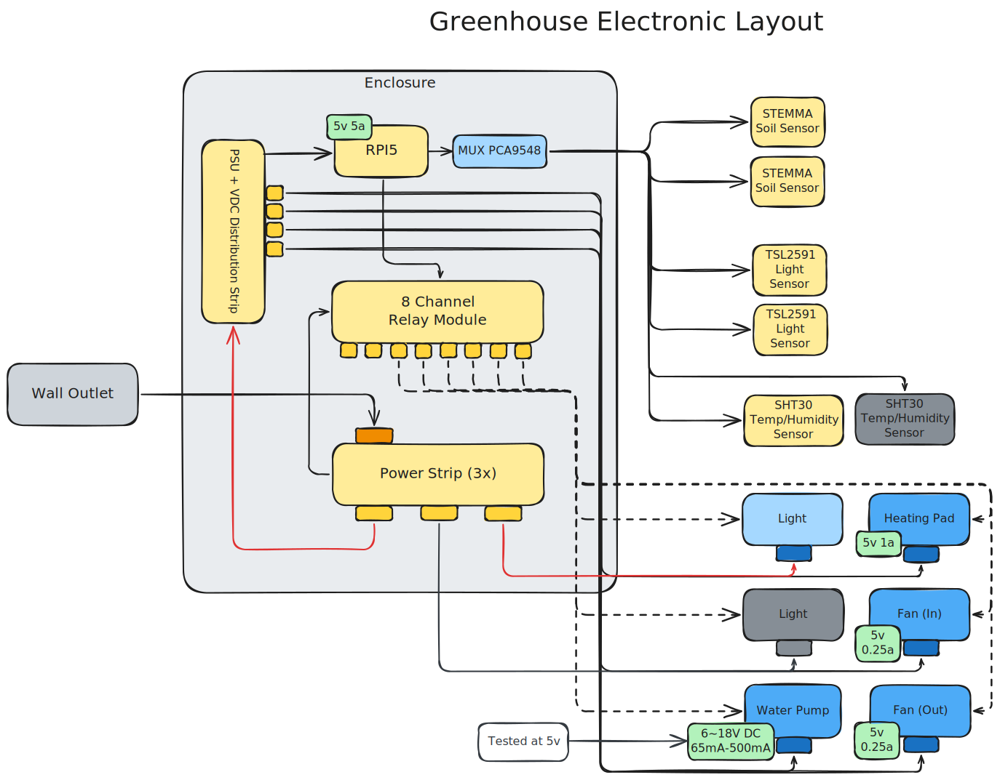

# Greenhouse Electrical Wiring
This section will describe the wiring of the electronics enclosure.

## Layout:

**TODO: Modify diagram to remove old unused components**

## Wiring Power

For power distribution, there are three main components:
1. Compact surge protector (3 outlets)
    * NOTE: If the specific surge protector (or any compact surge protectors), an alternative is potentially an AC distribution block with custom wiring application
2. 5V/10A AC Power Adapter
3. 120VAC Wire (for the light bulb)

## Wiring Raspberry Pi 5

Reference the pin layout for the Raspbeery Pi 5:

1. Use Pin 4 (5V) and Pin 6 (Ground) to power the RPi5 from the DC PDB
2. Use Pin 3 (SDA), Pin 5 (SCL), Pin 1 (3.3V), and Pin 9 (Ground) for the PCA9548 multiplexer
3. For the TS0012's GPIO pins, choose any GPIO pins listed above. The prototype used Pin 17, 22, 23, and 27 

## Wiring Instruments

1. For Fan 1 and 2, []
2. For the water pump, []
3. For the light bulb, []

## Wiring Sensors

1. Route all sensor wires through the side-hole of the electronics enclosure
2. Plug each sensor wire's JST end into the ports of the PCA9548.
3. Assuming that the RPi5 is powered and is properly connected to the PCA9548, run `i2cdetect -y 1` to check if the multiplexer is picked up. Utilize `devices/multiplexer.py` to see each device that is connected to multiplexer