# 3D Print List

| 3D Print Name | Last Updated | OnShape Link | STL Link | Description | Image |
|-------|-------|-------|-------|-------|-------|
| <a name="overall-greenhouse-structure">Overall Greenhouse Structure</a> | 2025-11-30   | [Link](https://cad.onshape.com/documents/063112a5bfb4a5e277752d22/w/941dd97197fd0682afca8445/e/f8253b9428505df70ceed1ac)   | N/A   | Full-scale 3D printed framework for small greenhouses, including reinforced roof beams, base anchors for ground stability, and adjustable vent openings for climate control.                                   | 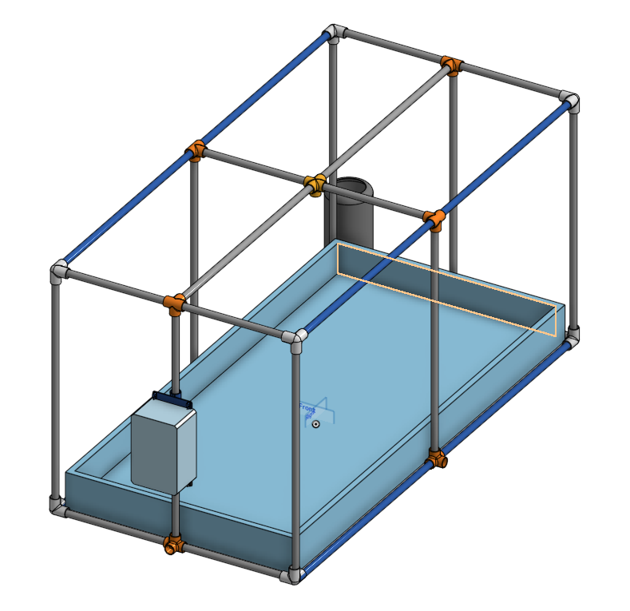 |
| <a name="top-mount-enclosure">Top Mount Enclosure</a>                     | 2025-11-30   | [Link](https://cad.onshape.com/documents/16dc69c69aa93ba824ef5bcf/w/ea1c51197901dd69b7fbc7b9/e/00677c414a9f3b4a09aeaa45)            | [STL](https://drive.google.com/file/d/1E7ocn_1j1Ug7ewE_hWq27UqPj9pBCQoZ/view?usp=sharing)             | Snap-fit enclosure designed to mount directly on top of electronics (e.g., Raspberry Pi, Arduino), with perforated sides for heat dissipation and a tool-less latch for easy access.                           | 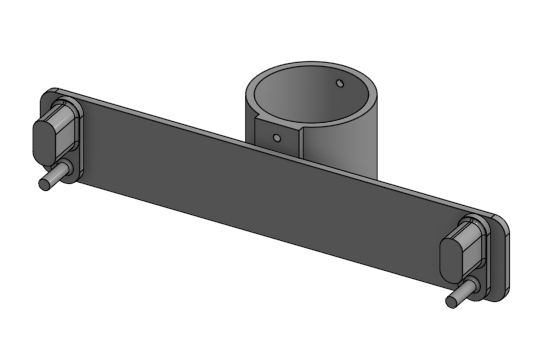 |
| <a name="bottom-mount-enclosure">Bottom Mount Enclosure</a>               | 2025-11-30   | [Link](https://cad.onshape.com/documents/0f5d4630cc1a9820835d5866/w/77f2d8b2f61da4d3e111a568/e/d6e13053d795dcd8d17cccde)          | [STL](https://drive.google.com/file/d/1a-xQ8UhSX53oMwLGx3hkqJrHLFD1XZeU/view?usp=sharing)          | Low-profile enclosure for mounting *underneath* surfaces (e.g., desks, shelves), featuring M3 screw holes for permanent installation and cable glands to route wiring neatly.                                   | 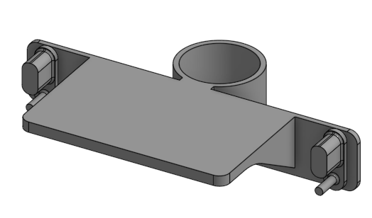 |
| <a name="gc0307-case">GC0307 Case</a>                                   | 2025-11-30   | [Link](https://cad.onshape.com/documents/82afde1662f9595c64302d34/w/9f322b040401ae09bda53c47/e/510dc5ca4084ff90b03f53de)                    | [Top STL](https://drive.google.com/file/d/1iO5qlbxvIbOiiU4-xfEoZ2Gkj5YVbLT_/view?usp=sharing), [Bottom STL](https://drive.google.com/file/d/1rBVoGSQiqqkCKCuL80cuCSwIEmQKiQao/view?usp=sharing)                    | Custom protective case for the GC0307 industrial controller, with cutouts for LED indicators, terminal blocks, and a removable lid for maintenance.                                                           | 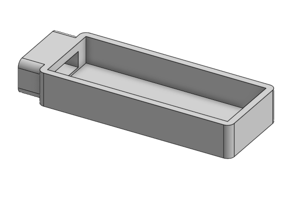 |
| <a name="pca9548-case">PCA9548 Case</a>                                 | 2025-11-30   | [Link](https://cad.onshape.com/documents/dbcc9bac41c6b526ef3e4bf1/w/dca83cfa7969e1b5a1301e76/e/083def149281b118c7c077a9)                    | [Top STL](https://drive.google.com/file/d/1PBEXPqAO_9wjNWdxvrCsWrtwkQOwIYhp/view?usp=sharing), [Bottom STL](https://drive.google.com/file/d/1bT6HuZTVcYZYTzbRVU2n-KrpJxhSxTBA/view?usp=sharing)                   | Compact enclosure for the PCA9548 I2C multiplexer, with transparent acrylic panels to visualize pin connections and a friction-fit base to avoid loose parts.                                                | 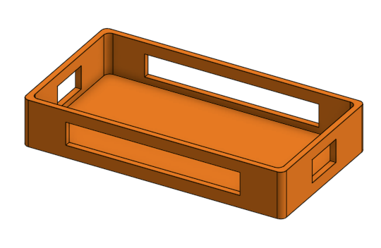 |
| <a name="tsl2591-mount">TSL2591 Mount</a>                               | 2025-11-30   | [Link](https://cad.onshape.com/documents/f060df4cb4efb8b32e44c8a8/w/ea83cda018d1f41fd761bdfc/e/13cabdd9740e7e0c5e1ad269)                    | [Top STL](https://drive.google.com/file/d/1-XsIpXyKmpcnVbwsjYXNGwuvOurxRV_I/view?usp=sharing), [Bottom STL](https://drive.google.com/file/d/1glmBsGk1HGaA-W1KCoqPp11roYgsDSUW/view?usp=sharing)                    | Adjustable mounting bracket for the TSL2591 light sensor, with 360° rotation and magnetic feet to attach to metal enclosures or 3D printed frames.                                                             | 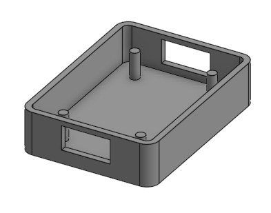 |
| <a name="120mm-fan-mount">120mm Fan Mount</a>                           | 2025-11-30   | [Link](https://cad.onshape.com/documents/69e9d40f44639ebaa905e3ca/w/2c4a69a7e84dfeea02b12514/e/94f1bfaae9c982d01b53566f)                 | [STL](https://drive.google.com/file/d/16yt1Slue9rNQiyD6xyGPs3Rx06nL8Lbd/view?usp=sharing)                 | Universal mount for 120mm PWM fans, compatible with standard 4-pin connectors, and featuring rubber grommets to reduce noise and prevent fan wobble.                                                           | 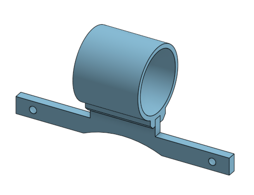 |
| <a name="tsl0012-mount">TSL0012 Mount</a>                               | 2025-11-30   | [Link](https://cad.onshape.com/documents/46af80c5f8778eded6d5d665/w/2196d4198d9a8ff0f39a8870/e/e296fd7cbdb19b317fdc653e)                    | [STL](https://drive.google.com/file/d/1-ZmbdxiGErHYFkD-B_gk3iJEJF48g0re/view?usp=sharing)                    | Alignment mount for the TSL0012 optical sensor, with micro-slot guides to ensure perfect registration with Raspberry Pi hats or custom PCBs.                                                                  | 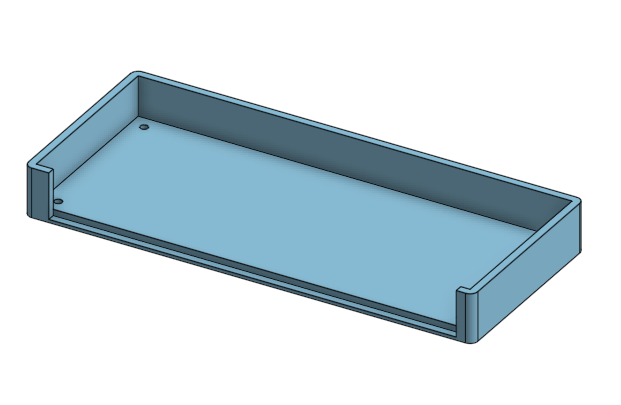 |
| <a name="rpi5-mount">RPI5 Mount</a>                                     | 2025-11-30   | [Link](https://cad.onshape.com/documents/e00aea743b655aa64e50def6/w/6e4002af322cab4160caa7f6/e/0e6379924ef9620b52332e06)                      | [STL](https://drive.google.com/file/d/12j_wzmqV94Tr6u2YjnIV09RF094jXDaz/view?usp=sharing)                      | Raspberry Pi 5-compatible mount with cutouts for GPIO headers, USB-C ports, and a passive aluminum heat sink slot, designed to fit both desktop and rack-mounted setups.                                       | 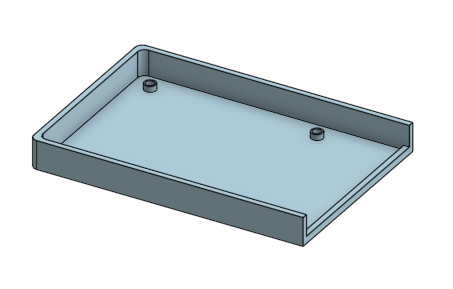 |
| <a name="three-way-connector">Three-way Connector</a>                   | 2025-11-30   | [Link](https://cad.onshape.com/documents/a3b330d5b68cbcff6f0be60a/w/5a16d6b519622e2e17ac7abb/e/0902c671acbb3839ffc4afb1)              | [STL](https://drive.google.com/file/d/1R6Ld_1x68hAUsPv5uLkmHAEH-HJhPXvt/view?usp=sharing)              | Insulated housing for three-way electrical connections, with color-coded terminals (red/black/blue) and a twist-lock mechanism to prevent accidental disconnection.                                          | 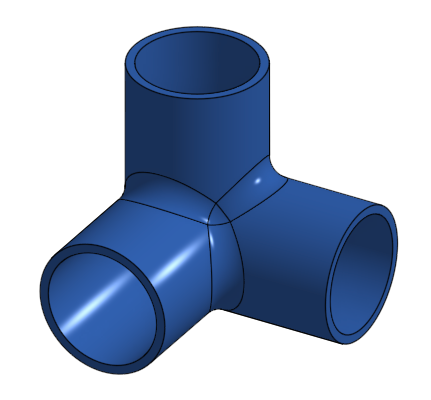 |
| <a name="four-way-connector">Four-way Connector</a>                     | 2025-11-30   | [Link](https://cad.onshape.com/documents/c4842b0c044c73d0c13a5bfd/w/e67faff0e5f3e51b5ca879a3/e/5bc06f8114eba26cb73f26e4)               | [STL](https://drive.google.com/file/d/1q8VIEczQQbhjmJyDuQwxPSa-baV5Ujtv/view?usp=sharing)               | Durable plastic enclosure for four-way cable management, with strain relief loops to protect wires and a keyed slot to ensure correct insertion into mating ports.                                              | 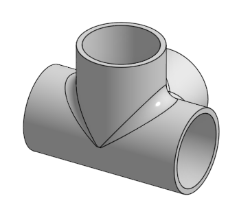 |
| <a name="five-way-connector">Five-way Connector</a>                     | 2025-11-30   | [Link](https://cad.onshape.com/documents/56ac4bfec16ce731c1f81a8d/w/a30286bbfdbdf69521975228/e/462ceab866b98ea37d19c7b7)               | [STL](https://drive.google.com/file/d/16Ub3RRTfojSSWJeChFQgiTPpe-KXsr30/view?usp=sharing)               | High-density connector mount for five-way systems (e.g., IoT sensors, automation networks), with numbered ports for easy wiring diagrams and a waterproof silicone gasket option.                              |  |
