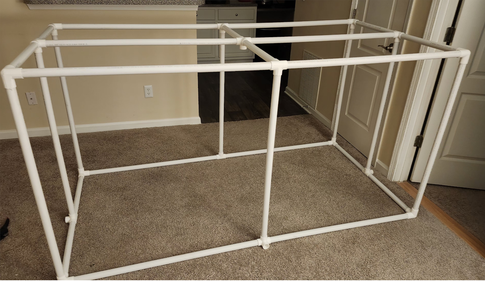
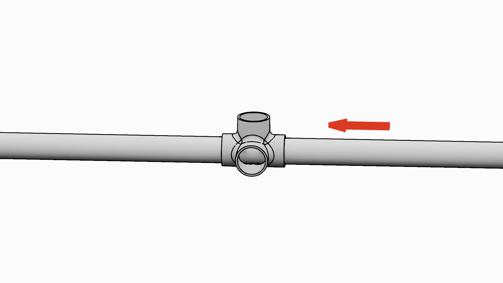
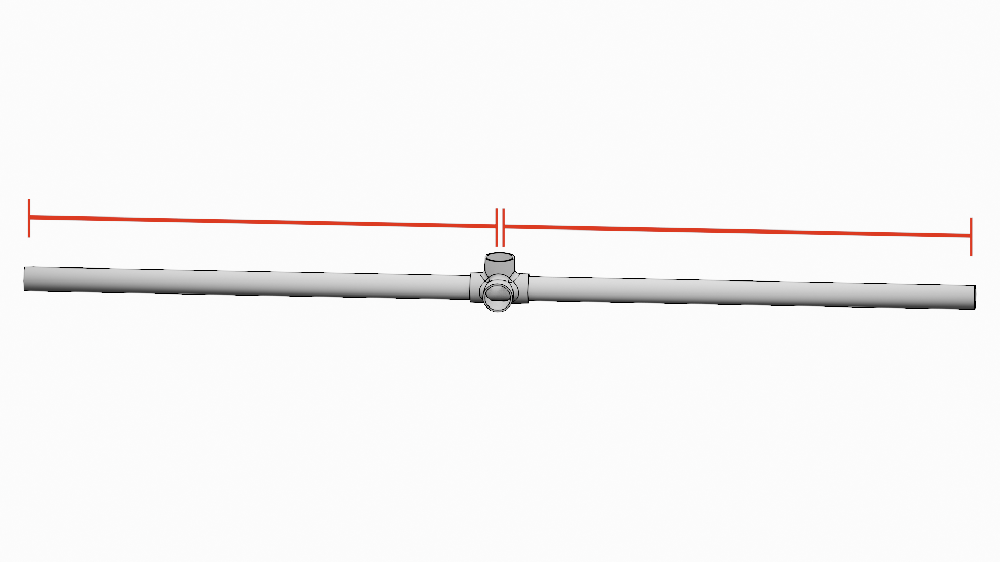
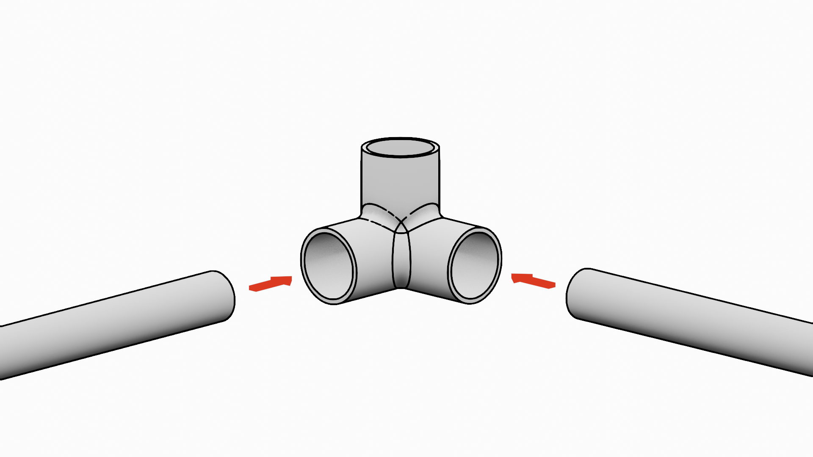
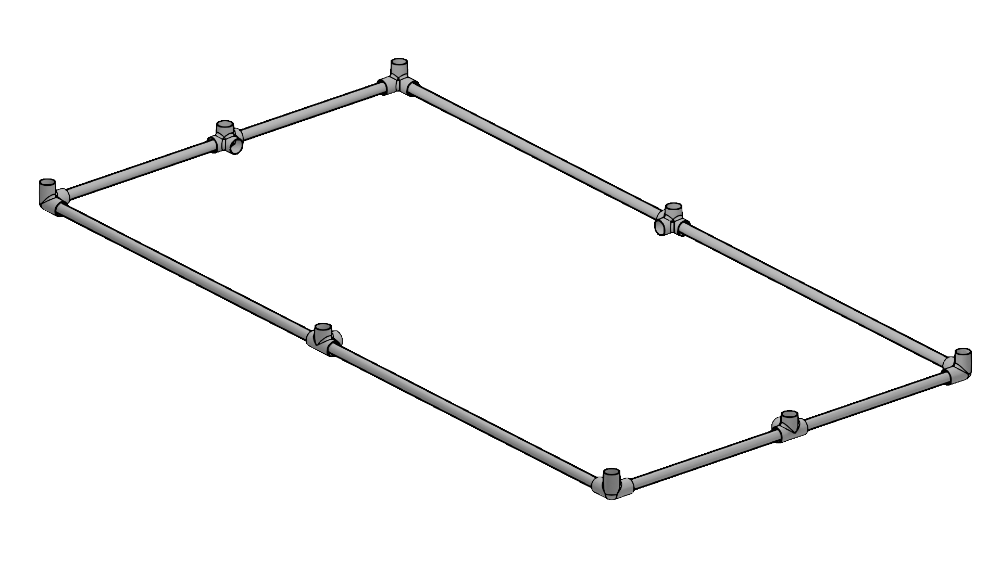
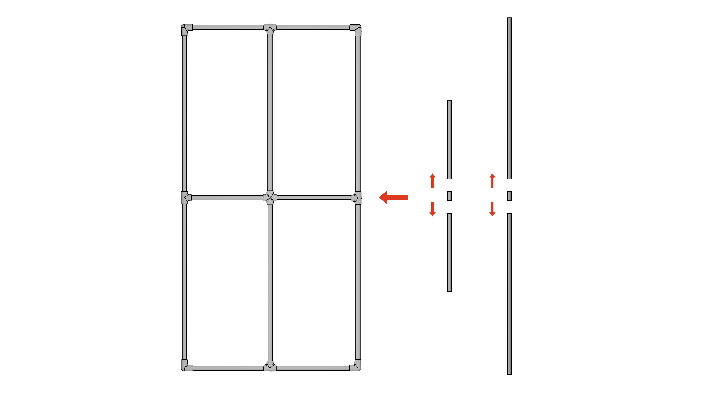
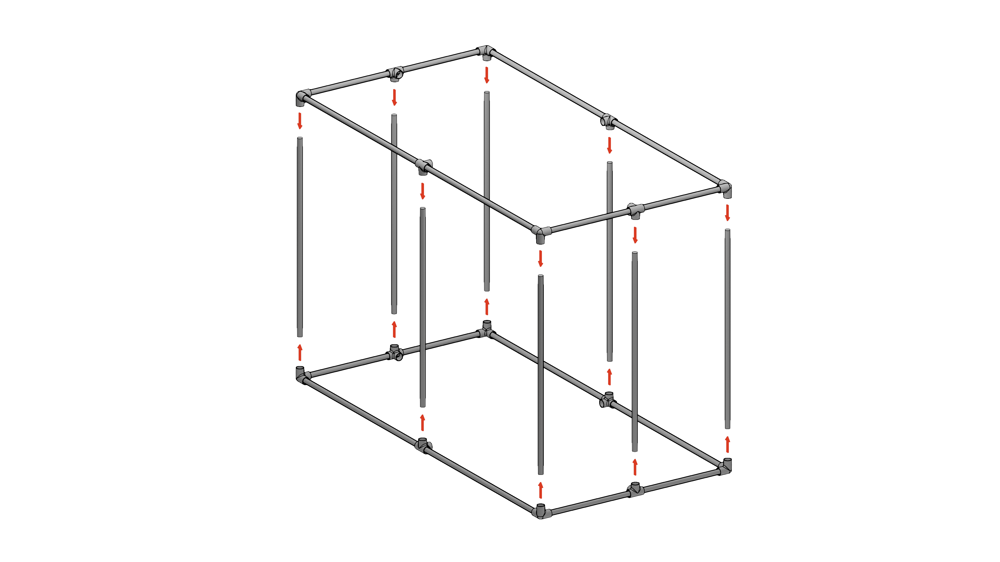
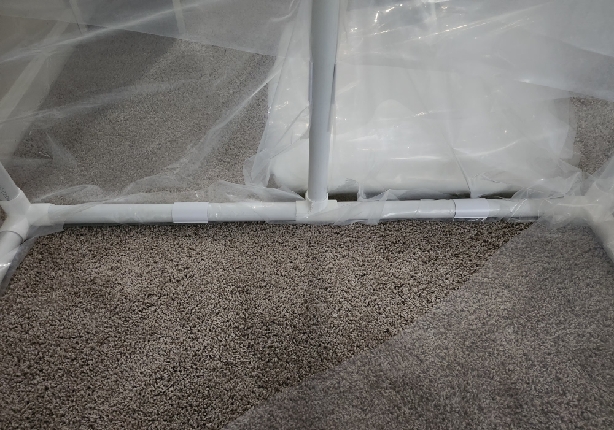
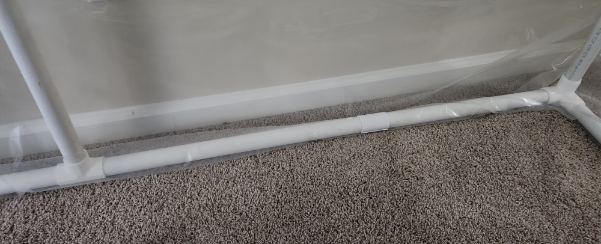
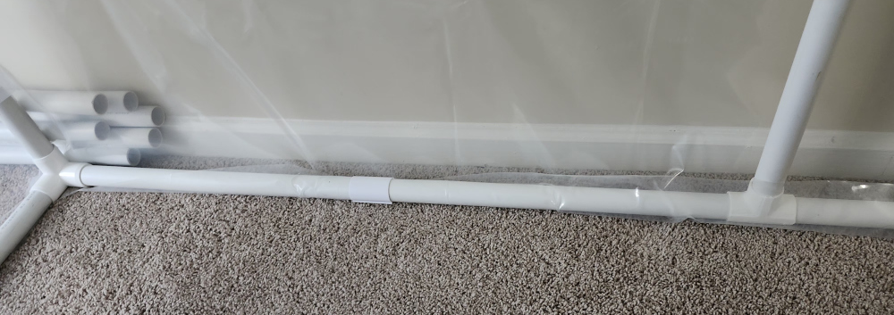

# Greenhouse Structure

The physical structure of the greenhouse is first and foremost inspired from this [article](https://frostygarden.com/topics/building-a-diy-small-seedling-greenhouse-with-pvc/). This project adds onto it by adding some additional joints and structures for an electrical enclosure and some supports for lights and wiring.

## Greenhouse Structure

This is a quick breakdown of all the materials needed to construct the physical greenhouse. When this document refers to the "physical greenhouse", it refers to the structure and the lighting (which can work without the need for an electrical enclosure).

### Frame Construction

1. Print out the 3-corner, 4L, and 5-corner PVC joints defined in the [MATERIALS.md](./MATERIALS.md)
2. Cut each 10ft PVC pipe into 1 meter and 2 meter segments (will be named as "short" and "long" pipes respectively)
3. Slide a 4L PVC joint into 4 long and 4 short PVC pipes, with 2 long and 2 short pairs for the top and bottom of the greenhouse. Try to align the PVC joint in the center of each of the pipes.

4. Assemble the bottom and the top frame of the greenhouse by connecting two long and two short PVC pipes with a 3-corner PVC joint.

5. For the top frame, take an additional long and short pipe. Cut them in half and then cut each cut piece by a small margin (~2-3cm) to allow "breathing-room" in the joint.

6. Connect the cropped long sides to the 5-corner PVC joint and to their adjacent side

7. Connect the bottom and top frames of the greenhouse together with supporting structures (which are just 8 short PVC pipes - this also means you should cut the 2m pipes you have into 2, 1m pipes)

## Overlaying the Tarp

After the frame is constructed, we need to lay the UV-resistant plastic tarp on top of the frame. This part will take a little bit of pratice and will require the tarp's width to be a minimum of ~1.5x the length of the greenhouse (2m).

Run the tarp over the structure along its width. Make sure you give enough slack for the tarp to be tucked underneath the bottom of the structure. For the 2m sides and the bottom PVC pipes, we use PVC clamps to bind the tarp to the pipes. This construction went for one clamp in the middle of each exposed pipe segment:

> [!NOTE]  
> I did not take good visual documentation on this part. Totally on me, but I will have some diagrams that attempt to recreate what the tarp and folds should look like. If you need better documentation, check out the inspired post at the beginning of this doucment.

As the wrap goes over the structure, two excess trianglular folds should appear on each corner. Like an envelope, fold the triangular folds towards each other on the short side of the greenhouse. They should overlap with one another. Press a clamp on the middle supporting pipe such that all three layers (the two folds and the flat layer)get pressed together. This will take some force. If the clamp is not staying in-place, use some strong tape or adhesive.

## Electrical Enclosure Mounting

### Mounting Brackets

3D print a [top](./) and [bottom](./) mounting bracket for this part. We are going to take advantage of the enclosure's metallic mounting braces to attach it to the center vertical PVC pipe. The mounting brackets will click into the holes in the mounting brace.

[PICTURE OF ENCLOSURE+BRACKETS]

Afterwards, slide the top and bottom brackets through the PVC until it is at a desired height. Take a M3-compatiable drill bit (or use a screwdriver) to create a hole where the two M3 screws with go on the back of the mounting bracket. These scews will hold the bracket and the entire enclosure up.

[PICTURE OF BRACKETS BEING SCREWED INTO PVC]

### Trace Light Wiring Through PVC (Optional)
 Cleanest way to place the center light in the greenhouse is to pass the wire through the 5-way joint and through the PVC pipe going towards the electrical enclosure. Cut that given PVC pipe where you want the wire to escape, and add a 3-way T-shape PVC joint to channel the wire out. For a permanent fit, use a liquid adhesive to join the cut PVCs together with the PVC joint. Otherwise, you might see a dip in the top part of your greenhouse.

### Tracing Wire Mesh
 To ensure that small sensor wires are not damaged and are organized cleanly, utilize a wire mesh. Fold the sensor wires into the mesh and then use tape or zip ties to attach the wire meshes onto the PVC pipe.

## Access Points

> [!CAUTION]  
> In version 1, access points are just hacky flaps that are supposed to act as tent "flaps". I'm realizing that this is not practical. Future iteraitons will not have this kind of access point.