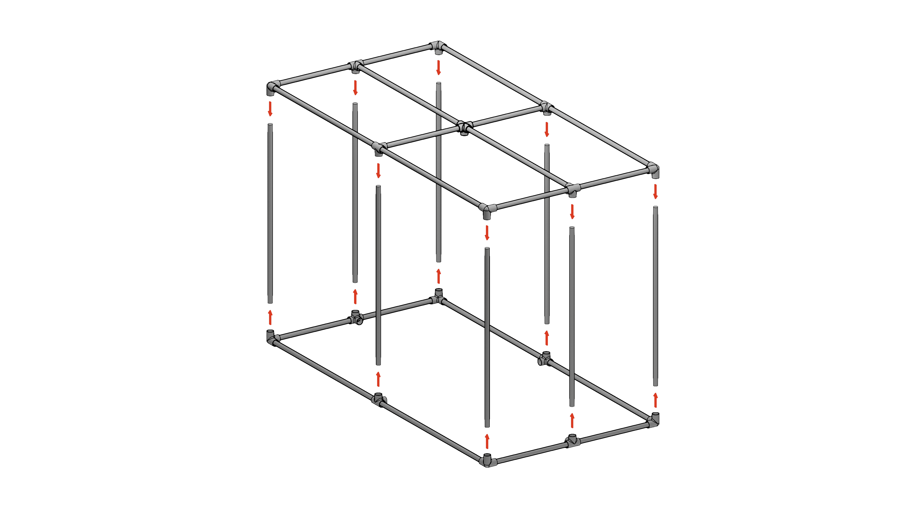

# Greenhouse Structure

The physical structure of the greenhouse is first and foremost inspired from this [article](https://frostygarden.com/topics/building-a-diy-small-seedling-greenhouse-with-pvc/). This project adds onto it by adding some additional joints and structures for an electrical enclosure and some supports for lights and wiring.

## Greenhouse Structure

This is a quick breakdown of all the materials needed to construct the physical greenhouse. When this document refers to the "physical greenhouse", it refers to the structure and the lighting (which can work without the need for an electrical enclosure).

### Frame Construction

1. Print out the 3-corner, 4L, and 5-corner PVC joints defined in the [MATERIALS.md](./MATERIALS.md)
2. Cut each 10ft PVC pipe into 1 meter and 2 meter segments (will be named as "short" and "long" pipes respectively)
3. Slide a 4L PVC joint into 4 long and 4 short PVC pipes, with 2 long and 2 short pairs for the top and bottom of the greenhouse. Try to align the PVC joint in the center of each of the pipes.

4. Assemble the bottom and the top frame of the greenhouse by connecting two long and two short PVC pipes with a 3-corner PVC joint.

5. For the top frame, take an additional long and short pipe. Cut them in half and then cut each cut piece by a small margin (~2-3cm) to allow "breathing-room" in the joint.

6. Connect the cropped long sides to the 5-corner PVC joint and to their adjacent side

7. Connect the bottom and top frames of the greenhouse together with supporting structures (which are just 8 short PVC pipes - this also means you should cut the 2m pipes you have into 2, 1m pipes)

## Electrical Enclosure

The electrical enclosure stores the following electrical components inside:

- Raspberry Pi 5
- Relay (TSL0012)
- DC Power Distribution Block
- DC Power Adapter
- Surge Protector
- 